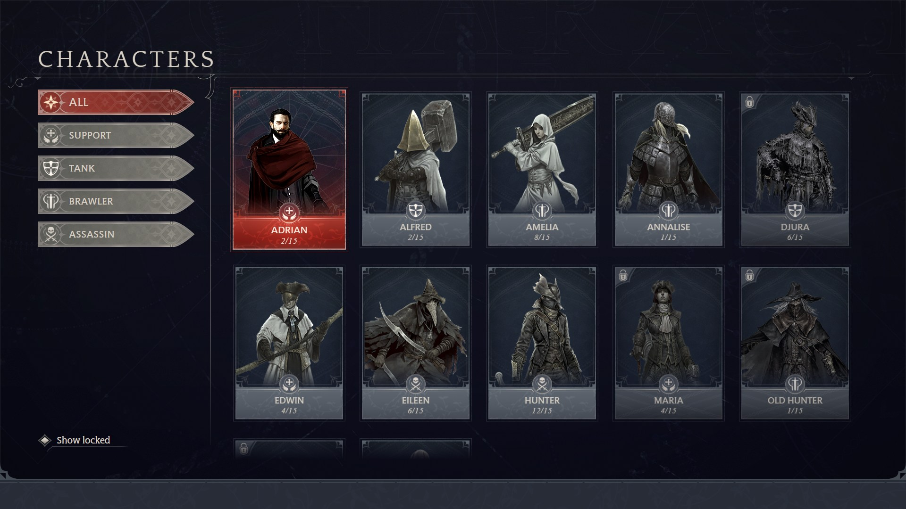

# Game UI Test

## Task Brief
Goal: create a responsive replica of target Game UI designs.
Requirements:
- All characters are showing initially
- The first character in grid is selected/active by default
- User can click a class filter on left to change which characters are showing
- User can toggle 'show locked' to show or hide locked characters
- All buttons and character cards have different states: normal, hovered, active

## Rules
- Only use the assets provided
- Use your own original code
- Use vanilla TypeScript, HTML and CSS (no React etc.)
- Make the code modular
- Feel free to experiment with your own animations

## Tech Stack
- Vite
- TypeScript
- CSS3
- Vanilla HTML/DOM

## Targeted Resolutions
- Primary: 1920x1080
- Secondary: 3840x2160 

## How to Run
```bash
npm install
npm run dev
```

Use browser dev tools to simulate device with 1080p and 4K resolutions.

## Areas of Learning & Improvement
What did you learn?
- Refreshed on creating and structuring vanilla TS apps, after 5+ years of working with React
- Learned a lot about using Claude as a collaborator on a UI dev project like this

What could be improved with more time?
- Exact sizing/positioning for assets including character portraits & class icons
  - Would have been nice to edit assets so they have identical dimensions (without stretching/shrinking) so they would play more nicely
- Polished fade effects on 'CHARACTERS' title, edges of character card etc
- More and better animations including hiding/showing character cards when filter is triggered, filter button state transitions, a more well-thought out intro animation (not just basic fade in)
- Support for tablet (landscape, portrait) 
- Some bugs including: selecting character after scrolling down the character grid causes grid to go back to top, obscuring active character

## Screenshots
Reference:


Actual:

